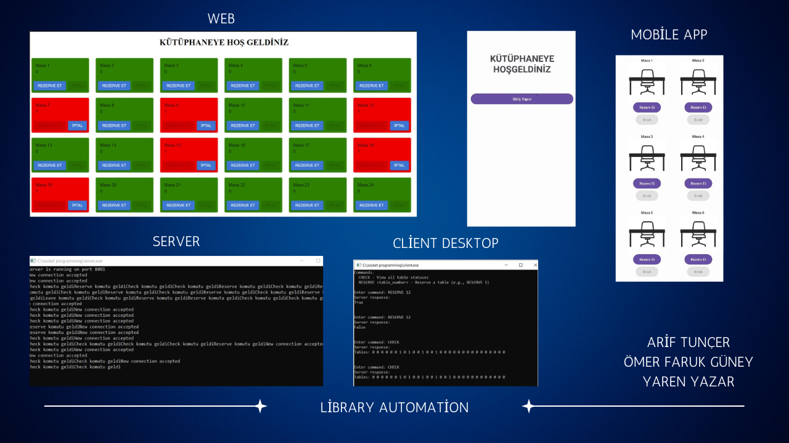

#Library Automation 
This project is about socket programming.
The server side of this project is written in C language. 
There are three clients. The clients connect to the server separately.
The clients send requests and receive responses from the server.

The main purpose of the project is to allow people who come to the library to check the occupancy status of the library and
to ensure that other users can see that the table is full when they sit at a table. 

First client side is web side, second side is mobile app side and last side is cmd (windows) side 
WEB CLİENT SİDE =https://github.com/omergny03/React-Projects/tree/main/Client-Server%20Project  
DESKTOP CLİENT SİDE =https://github.com/yarenyazar/library-automation

  UI SHOWCASE

                                                      .
